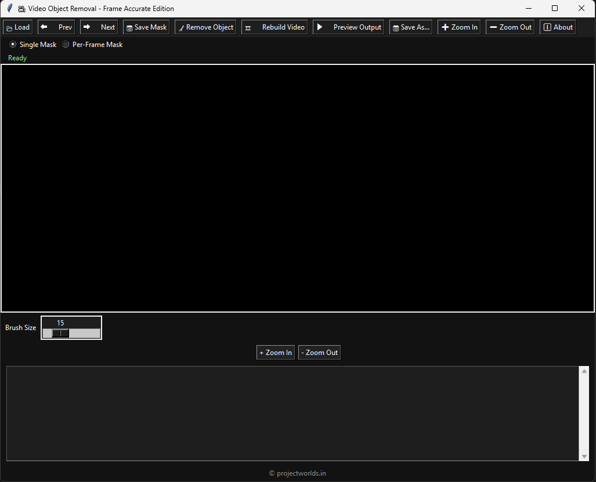
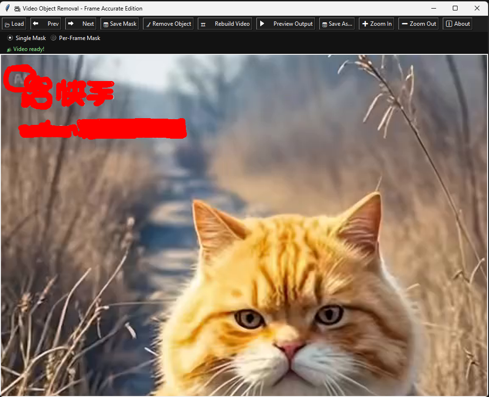
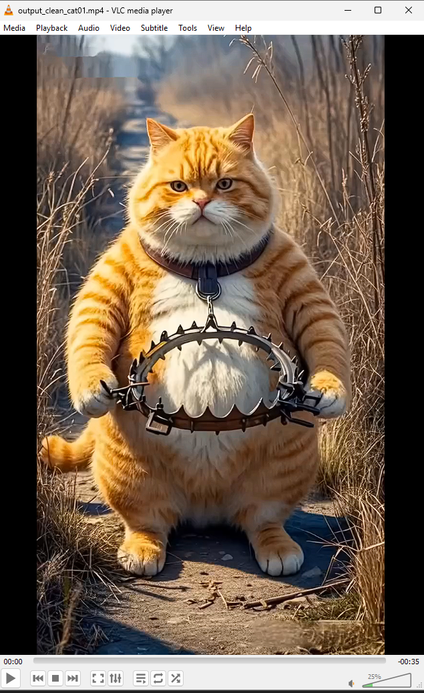

<p align="center">
  
</p>

<h1 align="center">🎥 Video Object Remover - Frame Accurate Edition</h1>

<p align="center">
  
</p>

<p align="center">
  <strong>Free & Open Source video object removal tool by <a href="https://projectworlds.in" target="_blank">Projectworlds</a></strong><br/>
  🧠 AI-powered brush masking, OpenCV inpainting, and FFmpeg-based video export.
</p>

<p align="center">
  <a href="https://youtube.com/@projectworlds" target="_blank">
    
  </a>
</p>

---

## 📸 Screenshots

### 🔧 Main UI  


### 🔧 Load Video UI  


### 🖌️ Masking in Action  


### 🎞️ Rebuilt Video Output  


---

## 🚀 Features

- 🎯 **Frame-accurate masking** with mouse brush tool
- 🧹 **AI-based object removal** using OpenCV inpainting
- 🖌️ Brush size slider
- 🔁 **Single Mask** and **Per-Frame Mask** support
- 🎞️ **Video export** using FFmpeg at original FPS
- 🧭 Easy navigation between frames
- 💾 Save + preview cleaned video
- 📝 Real-time status + logging
- 🌙 Dark theme for modern look
- ✅ **Built-in EXE — no setup required**

---

## 💻 How to Use

### 🟢 Option 1: Run the EXE (Windows)
Just download `VideoObjectRemover.exe` from the [Releases](https://github.com/projectworldsofficial/video-object-remover/releases/download/v1.0/video-object-removal-v1.0.exe) tab and run it.  
No installation or Python required.

### 🐍 Option 2: Run from Source (Cross-platform)
```bash
git clone https://github.com/your-username/video-object-remover.git
cd video-object-remover
pip install -r requirements.txt
python app.py
